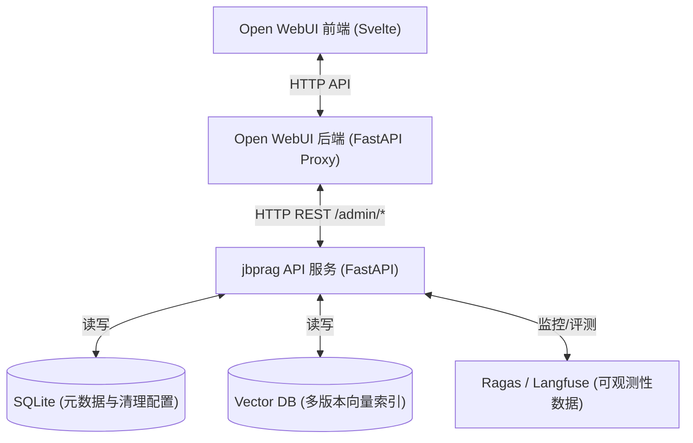

# Chip Agentic RAG 后台管理系统设计与实施方案

根据与用户的 `/grill-me` 沟通，我们将为 **Chip Agentic RAG (jbprag)** 构建一个深度集成于 **Open WebUI 管理员设置** 中的 RAG 后台管理系统。

---

## 1. 架构设计与集成关系

系统采用前后端分离的解耦设计，Open WebUI 前端通过其 FastAPI 后端代理，与 `jbprag` 的 API 服务进行 HTTP REST 交互：

---

## 2. 核心功能设计与细化实现策略

### 2.1 文档清理与解析配置 (Ingestion & Cleaning Panel)
* **默认清洗模板管理**：后台存储一套全局默认参数（如：页边距顶部 50px、底部 60px、默认过滤水印 "CONFIDENTIAL"）。
* **单文档覆写上传**：用户在上传新文档时，前端展示解析预览框，允许用户手动调整该文件的特定页边距和水印，覆写全局默认配置后再提交给 `jbprag` 解析。
* **物理清理与文本提取**：调用已有的 `clean_pdf.py` 物理擦除印章和页眉页脚，然后使用 `MarkItDown` 提取 Markdown 格式文本。

### 2.2 元数据分类管理与智能标注 (Metadata & Catalog Panel)
* **智能归类推断**：文件上传后，`jbprag` 的元数据提取器自动读取文件名与前几页内容，启发式推断文档类别（如 `PDK`、`Platform_Flow` 等）和 Vendor（如 `TSMC`），并返回给前端展示。
* **人工校对与标签编辑**：管理员在前端 UI 上对分类和标签进行确认或手动修改后，点击“提交向量库”，完成索引写入。
* **分类导航与维护**：提供树形或分组视图，按 `Platform_Flow`、`PDK`、`IP`、`StdCell`、`SRAM`、`Literature`、`Script`、`Project_Doc` 展示已导入文档。

### 2.3 索引多版本管理与热切换 (Index & Versioning Panel)
* **后台默默构建**：当需要重新构建索引（如修改分块大小或更换 Embedding 模型）时，`jbprag` 在后台创建带版本号的新向量库（如 `index_v2`），不影响当前线上服务的正常检索。
* **沙箱检索测试**：管理员可以在后台选择 `index_v2`，输入测试 query，直接预览检索出的 Chunks 及其得分，评估新索引的效果。
* **一键热切换 (Hot-Swap)**：点击“切换生产”按钮，瞬间修改生产路由的指向，实现无缝升级。

### 2.4 可观测性与评测双看板 (Observability & Evaluation Panel)
* **在线追踪看板**：集成链路跟踪，显示最近查询的详细解析流程，包括：原提问、重写后的多角度 Query、匹配到的每一个 Chunk（带召回/重排分数）、以及 LLM 的最终回答。
* **离线评估看板**：定期运行基于 Ragas 的评估任务，展示 `Recall`、`Precision`、`Faithfulness` 等关键指标的历史折线图，直观展现系统性能演进趋势。

---

## 3. 拟修改与新增的文件规划

### 3.1 jbprag 后端 API 扩展
#### [NEW] [admin_router.py](file:///home/eason/proj/open-webui/jbprag/src/admin_router.py)
* 提供 `/admin/config`、`/admin/ingest`、`/admin/documents`、`/admin/indexes`、`/admin/traces`、`/admin/evaluation` 接口。
#### [MODIFY] [main.py](file:///home/eason/proj/open-webui/jbprag/src/main.py)
* 挂载 `admin_router` 模块。

### 3.2 Open WebUI 后端代理
#### [MODIFY] [rag.py (open-webui)](file:///home/eason/proj/open-webui/backend/open_webui/routers/rag.py)
* 增加代理路由，将 `/api/v1/chip-rag/admin/*` 的请求代理转发至 `jbprag` 的 API 端口。

### 3.3 Open WebUI 前端管理界面
#### [NEW] [ChipRAGAdmin.svelte](file:///home/eason/proj/open-webui/src/lib/components/admin/Settings/ChipRAGAdmin.svelte)
* 新建 Svelte 组件，包含 Ingestion 配置、元数据编辑、索引多版本测试与热切换、全链路追踪看板四大子标签页。
#### [MODIFY] [Settings.svelte](file:///home/eason/proj/open-webui/src/lib/components/admin/Settings.svelte)
* 在管理设置左侧菜单栏中，新增 "Chip RAG 管理" 选项，点击后加载 `ChipRAGAdmin` 组件。

---

## 4. 验证计划

### 4.1 接口与逻辑单元测试
* 对 `admin_router.py` 的接口（摄入、修改分类、索引切换、追踪数据获取）编写单元测试，模拟请求验证逻辑正确性。
* 编写测试脚本验证索引热切换（Hot-Swap）期间，并发检索请求的完整性与零停机时间。

### 4.2 前端联调验证
* 上传带水印 PDF，在前端修改参数并上传，检查 `jbprag` 的 temp 目录中物理清理结果是否符合覆写参数。
* 修改某篇文档的 Category 和 Vendor 标签，点击保存后，通过 API 查询验证数据库及向量库中对应的元数据是否已更新。
* 触发后台索引重构，观察新索引构建期间，前端聊天是否正常；并在切换索引后验证检索数据源是否已更新。
