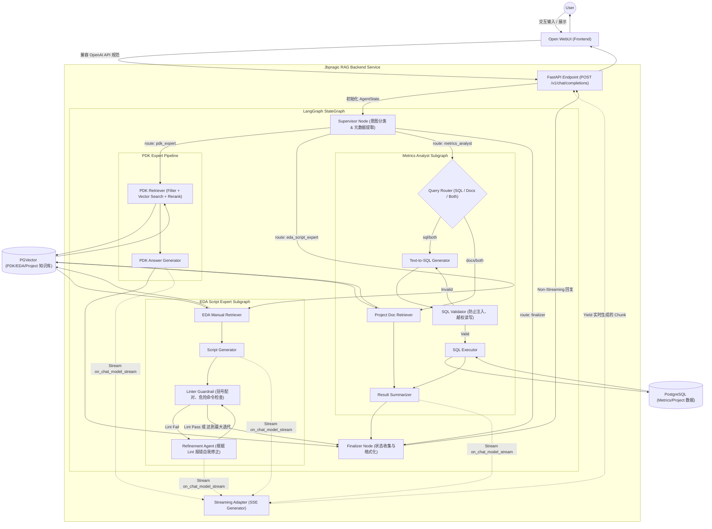

# Jbprag 工作流与系统集成设计图

下面是 `jbprag` 的核心流程图。它展示了整个系统是如何与 Open WebUI 进行对接的，以及内部基于 LangGraph 的多智能体工作流（Supervisor → Experts → Subgraphs）是如何协同工作的。

## 系统架构与工作流示意图

## 与 Open WebUI 对接原理解析

### 1. 协议伪装 (API Compatibility)
Open WebUI 原本设计为直接与 OpenAI (或其他标准模型) 的服务器通信。`jbprag` 利用 FastAPI 提供了一个完全兼容 OpenAI `ChatCompletion` 格式的接口：
- 暴露 `GET /v1/models`，伪装成拥有名为 `jbprag` 模型的服务器。
- 暴露 `POST /v1/chat/completions` 作为聊天入口。
- WebUI 只需要在设置中添加一个新的 OpenAI Connection，将 URL 指向 `http://<jbprag_ip>:<port>/v1` 并随便填入一个 key，即可将请求打给后端系统。

### 2. 状态映射 (State Mapping)
- **请求进来时**：FastAPI 层拦截到标准的 `messages` (如 `[{"role": "user", "content": "..."}]`)，通过工具函数转成 LangChain 内部的 `HumanMessage` / `SystemMessage` 对象，并用其初始化 LangGraph 的第一帧 `AgentState`。
- **响应出去时**：如果是普通的非流式请求，系统等图跑完了，把 `finalizer` 最后生成的那段话包装成 OpenAI response json 结构发回给 WebUI。

### 3. 流式交互 (Streaming Adapter)
Open WebUI 的灵魂在于打字机体验。后端是如何实现它的？
- `jbprag` 并没有简单地等全部跑完再返回，而是使用了 LangGraph 的异步事件流（`astream_events`）。
- 只有真正的 Expert 节点（例如 PDK 生成器、EDA 脚本生成器）产生新的 Token 时触发的 `on_chat_model_stream` 事件会被捕捉到。
- `Streaming Adapter` 将拦截到的各个 Token 包成 Server-Sent Events (SSE)，这就实现了与普通大模型完全一样的逐字显现效果。
- 中间的 Supervisor 路由思考、Lint 修正等动作（通常不触发 chat stream），对用户而言都是透明发生的，这为多步骤 Agent 隐藏了底层的复杂跳跃，最终只让用户看到提纯后的回答。
