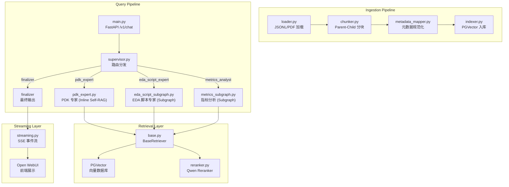

# jbprag 项目全面代码评审与改进建议

> 评审日期：2026-07-20 | 评审范围：Ingestion · Retrieval · Expert Graphs · Supervisor · Streaming · Prompts

---

## 一、架构概览



---

## 二、当前策略评估：亮点与优势

### ✅ 1. Parent-Child 双粒度分块设计（优秀）
- **小粒度检索（300 tok Child）+ 大粒度生成（2000 tok Parent）** 的分离策略在理论和实践上都是当前 RAG 领域的最佳实践
- 有效避免了大文本对向量特征的稀释，同时保证 LLM 生成时拥有充分的上下文窗口

### ✅ 2. 图文物理绑定（优秀）
- 图片 Markdown 标记与描述文字在 Parent Chunk 层面强制共存，从根源上解决了图文分裂问题
- 配合 SQL 直查图片分块 + Reranker 加分的兜底机制，形成了多层保障

### ✅ 3. Self-RAG 质量保障闭环（良好）
- 检索阶段：相关性评分 → 查询重写 → 重试（最多 3 轮）
- 生成阶段：幻觉检测 + 完整性检测 → 反馈重生成（最多 3 轮）
- 覆盖了 PDK Expert、EDA Script Expert、Metrics Analyst 三条路径

### ✅ 4. Supervisor 路由与多轮对话清洗（良好）
- 用 JSON Schema 引导 LLM 做结构化路由决策，避免了 LLM 自由发挥
- 多轮对话中将历史长文本 RAG 响应替换为 `"[Answered by expert node]"`，有效防止了 Supervisor "角色扮演陷阱"

### ✅ 5. 元数据规范化体系（良好）
- 完整的别名映射系统（~30 个 category 别名、tool/node/vendor/project_id 别名）
- `project_id = "jbp"` → `None` 的平台名规范化规则已正确实现

### ✅ 6. Prompt 工程质量（良好，8/10）
- 中英双语格式要求、引文保留规则、图片展示规则均有明确约束
- 各路由路径的 Prompt 风格一致，Few-shot 示例覆盖充分

---

## 三、发现的关键问题

### 🔴 P0 — 严重问题（直接影响功能正确性）

#### 1. Streaming 节点白名单遗漏子图节点 — 子图 Token 被静默丢弃
- **位置**：[streaming.py:22](file:///home/eason/proj/open-webui/jbprag/src/streaming.py#L22)
- **问题**：允许流式输出的节点白名单为：
  ```python
  ["pdk_expert", "eda_script_expert", "refinement_agent",
   "metrics_analyst", "summarize", "summarizer", "text_to_sql", "finalizer"]
  ```
  但 EDA 子图实际节点名为 `generate`、`refine`、`retrieve`、`lint`、`finalize`；Metrics 子图实际节点名为 `route`、`generate_sql`、`validate_sql`、`execute_sql`、`retrieve_docs`、`summarize`、`clarify`。
- **影响**：EDA 子图的 `generate`/`refine` 节点和 Metrics 的 `summarize` 节点产生的中间流式 Token **全部被静默丢弃**，用户看不到实时生成过程，只能在最后通过 `finalizer` 的 `final_answer` 一次性看到结果。
- **修复建议**：将子图内部实际节点名全部加入白名单，或改为黑名单机制（排除不需要流式输出的节点）。

#### 2. `vendor` 字段在索引阶段被丢弃
- **位置**：[indexer.py:43-56](file:///home/eason/proj/open-webui/jbprag/src/ingestion/indexer.py#L43-L56)
- **问题**：`_build_document()` 构建 LangChain Document 时，metadata dict 中**缺少 `"vendor": meta.vendor`**。`metadata_mapper.py` 中虽然正确规范化了 vendor 字段，但在入库时被静默丢弃。
- **影响**：新入库的文档将无法通过 vendor 进行过滤检索。此前数据库中的 vendor 数据是通过 SQL 补丁手动修复的，而非自然流入。
- **修复建议**：在 `_build_document` 的 metadata dict 中添加 `"vendor": meta.vendor`。

#### 3. Supervisor Prompt 中的 `vendor` 字段未被 QueryMetadata 消费
- **位置**：[metadata.py](file:///home/eason/proj/open-webui/jbprag/src/metadata.py) vs [supervisor_prompt.py](file:///home/eason/proj/open-webui/jbprag/src/prompts/supervisor_prompt.py)
- **问题**：Supervisor Prompt 要求 LLM 输出包含 `"vendor"` 的 JSON，但 `QueryMetadata` Pydantic 模型**没有 `vendor` 字段**。LLM 输出的 vendor 信息被 Pydantic 静默丢弃。
- **影响**：Supervisor 的 vendor 识别能力完全无效。
- **修复建议**：在 `QueryMetadata` 中添加 `vendor: Optional[str] = None`，并在 retriever 的 `_build_filter()` 中使用。

---

### 🟡 P1 — 重要问题（影响性能或可靠性）

#### 4. Reranker 在 async 路径中同步阻塞事件循环
- **位置**：[base.py:303](file:///home/eason/proj/open-webui/jbprag/src/retrieval/base.py#L303) + [reranker.py:35](file:///home/eason/proj/open-webui/jbprag/src/retrieval/reranker.py#L35)
- **问题**：`aretrieve()` 是 async 函数，但调用的 `QwenRerankerClient.rerank()` 内部使用 `httpx.Client`（同步 HTTP）。在高并发场景下会阻塞 asyncio 事件循环。
- **修复建议**：为 `QwenRerankerClient` 添加 `async def arerank()` 方法，使用 `httpx.AsyncClient`。

#### 5. `retrieve()` 与 `aretrieve()` 约 150 行代码复制粘贴
- **位置**：[base.py:45-177](file:///home/eason/proj/open-webui/jbprag/src/retrieval/base.py#L45-L177) vs [base.py:179-326](file:///home/eason/proj/open-webui/jbprag/src/retrieval/base.py#L179-L326)
- **问题**：除了 `await` 关键字和 `run_in_executor` 桥接外，两个方法的逻辑完全相同。任何修改都需要在两处同步，极易遗漏。
- **修复建议**：抽取核心逻辑为私有方法，`retrieve` 和 `aretrieve` 仅做 sync/async 适配。

#### 6. Parent Overlap 导致父区块实际大小超过 2000 Tokens
- **位置**：[chunker.py:221-233](file:///home/eason/proj/open-webui/jbprag/src/ingestion/chunker.py#L221-L233)
- **问题**：Overlap 是在父区块构建完成**之后**追加的前缀（以 ` ... ` 分隔）。一个 2000 token 的父区块加上 500 token 的 overlap 前缀，实际大小约 **2500 tokens**。
- **影响**：子分块数量膨胀（从 ~7 个变为 ~9 个），索引体积增大约 25%。
- **修复建议**：将 overlap 纳入 `max_parent_tokens` 预算（即父区块正文最多 1500 tok + overlap 500 tok = 2000 tok 总量），或在 overlap 追加后重新做 token 截断。

#### 7. Metrics 子图 `retrieve_docs_node` 中查询在循环前被预先重写
- **位置**：[metrics_subgraph.py:236](file:///home/eason/proj/open-webui/jbprag/src/experts/metrics_subgraph.py#L236)
- **问题**：`rewrite_query` 在 Self-RAG 循环**之前**就被调用了，导致第一次检索使用的是重写后的查询而非用户原始查询，丧失了原始语义信号。
- **修复建议**：删除循环前的 `rewrite_query` 调用，仅在循环内检索失败后触发重写。

#### 8. Markdown 表格从不被切分
- **位置**：[chunker.py:286](file:///home/eason/proj/open-webui/jbprag/src/ingestion/chunker.py#L286)
- **问题**：预切分逻辑仅对 `paragraph` 类型的块生效。如果一个 Markdown 表格超过 `max_chunk_tokens`（2000 tok），它会作为单个超大块直接进入 Parent Chunk，生成一个远超限制的子块。
- **影响**：EDA 手册中大型命令参考表格（如 Innovus TCR）可能产生超大分块。
- **修复建议**：为 `table` 类型块也添加按行切分逻辑。

---

### 🟠 P2 — 中等问题（影响可维护性或一致性）

#### 9. PDK Expert 采用内联 Self-RAG，与 EDA/Metrics 的子图模式不一致
- **位置**：[pdk_expert.py](file:///home/eason/proj/open-webui/jbprag/src/experts/pdk_expert.py)
- **问题**：PDK Expert 在单个函数内实现了完整的 Self-RAG 循环（检索→评分→重写→生成→评估），而 EDA 和 Metrics 使用了更结构化的 LangGraph 子图。架构不一致增加了维护成本。
- **修复建议**：将 PDK Expert 也重构为 LangGraph 子图，与其他两个专家保持一致。

#### 10. Self-RAG 评估器全部采用 Fail-Open 设计
- **位置**：[evaluators.py](file:///home/eason/proj/open-webui/jbprag/src/evaluators.py)
- **问题**：`grade_document_relevance`、`grade_hallucination`、`grade_answer_completeness` 在 LLM 调用失败时**均默认返回 `True`**。这意味着如果评估 LLM 不可用，所有质量检查会被静默跳过。
- **影响**：在 LLM 服务不稳定时，可能输出低质量或幻觉内容。
- **修复建议**：至少添加 `logger.warning` 日志；考虑对关键路径（如幻觉检测）采用 Fail-Close 策略。

#### 11. 硬编码的文件路径映射和配置值
- **位置**：多处
  - [base.py:67-73](file:///home/eason/proj/open-webui/jbprag/src/retrieval/base.py#L67-L73): 手册文件路径映射
  - [streaming.py:65](file:///home/eason/proj/open-webui/jbprag/src/streaming.py#L65): `localhost:8000`
  - [metrics_subgraph.py:34-42](file:///home/eason/proj/open-webui/jbprag/src/experts/metrics_subgraph.py#L34-L42): `DB_SCHEMA`
  - 各子图中：`top_k=3`、`max_retries=2`
- **修复建议**：将可配置参数迁移到 `settings.py`。

#### 12. `streaming.py` 中 Category→Collection 映射不完整
- **位置**：[streaming.py:52-57](file:///home/eason/proj/open-webui/jbprag/src/streaming.py#L52-L57)
- **问题**：仅映射了 `EDA`、`PDK`、`PROJECT` 三种 Category，而系统定义了 9 种 Category（`PDK`, `StdCell`, `SRAM`, `IP`, `EDA`, `Platform_Flow`, `Project_Doc`, `Script`, `Literature`）。
- **影响**：未映射的 Category 默认回退到 `eda_manuals`，引文链接可能指向错误的集合。

#### 13. Reranker 失败时完全静默
- **位置**：[reranker.py:50-52](file:///home/eason/proj/open-webui/jbprag/src/retrieval/reranker.py#L50-L52)
- **问题**：`except` 块直接 `pass`，没有任何日志输出。当 Reranker 服务不可用时，系统静默降级为 IdentityReranker，但运维人员无法感知。
- **修复建议**：添加 `logger.warning("Reranker failed, falling back to identity", exc_info=True)`。

#### 14. 图片 SQL 查询绕过了部分 PGVector 元数据过滤
- **位置**：[base.py:130-137](file:///home/eason/proj/open-webui/jbprag/src/retrieval/base.py#L130-L137)
- **问题**：`find_image_chunks()` 直接执行 SQL 查询，仅手动应用 `source` 和 `tool.$nin` 过滤。其他元数据过滤（`category`、`node`、`project_id`）被完全忽略。
- **影响**：图片搜索可能返回不属于当前查询范围的图片块。

---

### 🟢 P3 — 低优先级问题

| # | 问题 | 位置 |
|---|------|------|
| 15 | `wants_image` 在同一方法内被计算 3 次（重复关键词列表） | `base.py` |
| 16 | `import re` 和 `import psycopg` 在方法内部每次调用都执行 | `base.py` |
| 17 | `QwenRerankerClient` 每次检索都新建实例（无连接复用） | `base.py:154,303` |
| 18 | `IdentityReranker` 在 `top_k > 10` 时产生负分 | `reranker.py:60` |
| 19 | `asyncio.get_event_loop()` 已废弃，应使用 `get_running_loop()` | `base.py:263` |
| 20 | `RetrievalRequest` / `RetrievalResult` 类型已定义但从未使用 | `types.py` |
| 21 | `parse_json_safely` 被多个模块从 `supervisor.py` 导入（循环依赖风险） | `supervisor.py` |
| 22 | 子分块参数（300/50）在 `chunker.py` 中硬编码，未暴露为可配置参数 | `chunker.py:300` |
| 23 | EDA Prompt 指引编号从 5 跳到 7（缺少第 6 条） | `eda_prompt.py` |
| 24 | `load_all_documents` 仅支持 3 种 JSONL 类型，无法加载 StdCell/SRAM/IP 等 | `loader.py` |

---

## 四、改进优先级路线图

### 第一阶段：紧急修复（1-2 天）
- [ ] **P0-1**: 修复 streaming.py 节点白名单，补全子图节点名
- [ ] **P0-2**: 在 `_build_document` 中补充 `vendor` 字段
- [ ] **P0-3**: 在 `QueryMetadata` 中添加 `vendor` 字段并在 retriever filter 中使用

### 第二阶段：重要优化（3-5 天）
- [ ] **P1-4**: 为 Reranker 添加 async 支持
- [ ] **P1-5**: 消除 `retrieve`/`aretrieve` 的代码重复
- [ ] **P1-6**: 修复 Parent Overlap 超出限制的问题
- [ ] **P1-7**: 删除循环前的预重写调用
- [ ] **P1-8**: 为 Table 类型块添加切分逻辑

### 第三阶段：架构统一（1-2 周）
- [ ] **P2-9**: 将 PDK Expert 重构为 LangGraph 子图
- [ ] **P2-10**: 为评估器添加失败日志 + 关键路径 Fail-Close
- [ ] **P2-11**: 将硬编码配置迁移到 `settings.py`
- [ ] **P2-12**: 补全 Category→Collection 映射
- [ ] **P2-13**: 为 Reranker 添加失败日志
- [ ] **P2-14**: 为图片 SQL 查询补充完整的元数据过滤

### 第四阶段：代码质量提升（持续）
- [ ] P3 级别的代码整洁度改进

---

## 五、整体评分

| 维度 | 评分 | 说明 |
|------|------|------|
| **架构设计** | ⭐⭐⭐⭐ (8/10) | Parent-Child 分块 + Self-RAG 闭环 + 多路由专家分发 = 业界前沿设计 |
| **检索质量** | ⭐⭐⭐⭐ (7.5/10) | 双粒度检索 + Reranker + 图片兜底机制 = 强，但 vendor 过滤失效和图片 SQL 过滤不全拉低了分数 |
| **生成质量** | ⭐⭐⭐⭐ (8/10) | Self-RAG 三重闭环保障 + 双语 Prompt 工程 = 优秀 |
| **代码质量** | ⭐⭐⭐ (6/10) | 大量代码重复（retrieve/aretrieve）、硬编码值、静默失败、架构不一致 |
| **可运维性** | ⭐⭐⭐ (6/10) | 关键路径缺少日志、配置硬编码、无健康检查端点 |
| **综合评价** | **⭐⭐⭐⭐ (7.5/10)** | **核心设计理念先进，但工程实现细节需要打磨** |

> **结论**：jbprag 的 RAG 架构设计处于业界前沿水平（Parent-Child 双粒度 + Self-RAG + 多专家路由），核心检索和生成策略已经能满足当前的 EDA 手册问答需求。但在代码质量和工程健壮性方面存在较多可改进空间，尤其是 3 个 P0 级别的问题（streaming 白名单、vendor 字段丢失）需要优先修复，否则会直接影响用户体验和数据一致性。
