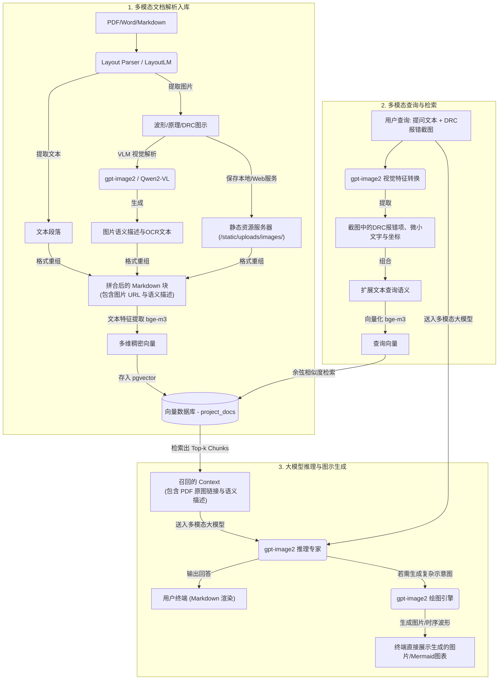

# 多模态 RAG (MM-RAG) 架构设计方案 (物理设计 & DRC 截图分析)

为了支持用户上传 DRC 截图、自动检索匹配规则图示、以及生成辅助设计原理图，我们需要将现有的文本 RAG 系统重构为**多模态 RAG (Multimodal RAG)**。本方案依托您可获得的 `gpt-image2` 多模态视觉大模型，设计了一套端到端的物理设计视觉问答与图表生成架构。

---

## 1. 架构整体拓扑 (Architecture Topology)

下图展示了多模态数据流从**文档解析入库（Ingestion）**到**多模态查询检索与图示生成（Query & Generation）**的闭环过程：



---

## 2. 核心模块设计说明 (Core Modules)

### 模块一：多模态文档解析与入库 (Multimodal Ingestion)

#### 1. 视觉元素分离与本地持久化
在处理 PDK、StdCell、SRAM 等文档时，我们使用高精度的 PDF 版面分析工具（如 `marker` 或 `PyMuPDF`）对页面进行排版解析。
* **物理保存**：检测到图表（Figure）、表格（Table）、时序图（Timing Diagram）时，将其截取为独立的 `.png` 文件，利用 MD5/SHA256 生成唯一标识，存入静态文件服务区：
  `\\wsl.localhost\Ubuntu\home\eason\proj\open-webui\backend\static\uploads\images\<md5_hash>.png`
* **地址归一化**：在 Markdown 解析流中，将其地址转换为 Web 服务可直接访问的相对路径：
  `/static/uploads/images/<md5_hash>.png`

#### 2. VLM 提取视觉语义 (Image-to-Text Captioning)
由于文本向量模型无法直视图片，我们需要通过多模态视觉模型将图片中的信息“翻译”为包含丰富专业术语的文字。调用 `gpt-image2` 对提取的图片进行标注：
* **输入**：提取的图片文件
* **提示词（Prompt）**：
  > "你是一个芯片后端物理设计与制造工艺专家。请详细分析该图片，提取其中的关键设计信息：
  > 1. 识别图片类型（如：DRC间距规则图示、标准单元结构图、时序波形图、Power Grid排布等）。
  > 2. 提取图中的所有文字、公式、表格数据、信号线名称和坐标。
  > 3. 用专业设计语言描述图中所展现的物理规则（如：Metal 2 Same-Net Spacing 要求为 28nm）。
  > 4. 输出一个结构化的中文描述。"
* **拼合入库**：
  将提取出的语义描述作为隐藏文本段落，紧跟在图片 Markdown 链接之后，拼合成一个完整的 Chunk 送入向量化：
  ```markdown
  ### 规则图示 3-1: M2 间距规则
  
  *图 3-1 展示了 Metal 2 间距定义规则。*
  <!-- VLM-IMAGE-SEMANTICS-START
  【类型】DRC 物理规则示意图
  【工艺与工具】TSMC N7, Innovus
  【提取文本】"M2 Spacing Check", "Min Spacing = 28nm", "Different Net"
  【语义描述】该图展示了 N7 工艺下同一金属层 Metal 2 的最小间距（Min Spacing）要求。图中画出了两条平行的 Metal 2 金属走线，属于不同的网络（Different Net），标注的最小安全间距为 28nm。若间距低于该阈值，将触发 M2.S.1 Spacing 违规。
  VLM-IMAGE-SEMANTICS-END -->
  ```

---

### 模块二：DRC 报错截图问答与检索 (Screenshot-to-DRC RAG)

当物理设计工程师遇到 DRC 报错时，他们可以直接截图并上传（例如在 Open WebUI 中上传一张 `Innovus` 弹出的 M2 间距违规高亮截图，并提问：*“这个 DRC 错误怎么解？规则是什么？”*）。

#### 1. 截图特征提取
多模态路由节点将**查询文本**与**截图**发送给 `gpt-image2` 进行查询转译：
* **提示词（Prompt）**：
  > "请分析用户上传的芯片后端设计工具（如 Innovus/ICC2）截图：
  > 1. 识别这是什么界面（如：Layout 视窗、DRC 报错日志列表、时序分析报告）。
  > 2. 提取出界面中高亮或选中的 DRC 违规名称、层级（如 M2、VIA3）、具体违规的坐标位置或数值。
  > 3. 翻译为用于数据库检索的检索词列表。例如，若看到 Metal 2 间距高亮和 'Spacing' 报错，输出检索词：'Metal 2 Spacing Error TSMC N7'。"
* **生成检索词**：模型输出结构化的文本，例如：`"M2 Spacing Violation rule, TSMC N7, different net spacing"`。

#### 2. 混合检索匹配
系统将**生成的检索词**与**用户原始提问**拼接，作为查询文本，通过 `bge-m3` 计算查询向量，去向量数据库检索。
由于我们在模块一入库时为规则示意图生成了包含 `"M2 Spacing Violation"` 的语义描述，检索系统将能**以极高的精度召回对应的工艺规则文档和当时入库的规则示意图**。

#### 3. 协同推理回答与精确引用
将召回的上下文（包括规则文字、PDF 里的示意图链接）连同用户的报错截图送入 VLM，模型生成如下诊断回答：
> “您的截图显示了一个 **M2 Spacing Violation** 错误 [1]。根据 TSMC N7 DRC 手册第 3.2 节的规定，处于不同网络（Different Net）的相邻 Metal 2 金属线之间最小物理间距必须满足 **28nm** [1]。
> 
> 手册中提供的设计规范图示如下：
> 
> 
> 
> **解法建议**：
> 1. 在 Innovus 中使用 `editPin` 或手动拉伸走线，使两条 M2 走线间距大于 28nm。
> 2. 运行 `routeDesign -detailRoute` 尝试由布线工具自动修复。”

---

### 模块三：辅助示意图生成 (Generative Illustration)

当用户提出非常抽象的复杂设计问题（如：*“如何规划一个标准单元的 Power Strap 架构？”*），数据库中可能没有完全匹配的现成图片，此时我们需要大模型生成一张图示来辅助解释。

由于标准的艺术类扩散模型（如 SD3、DALL-E 3）完全不懂芯片版图，会画出带有艺术感但充满逻辑错误的“抽象芯片艺术图”，无法用于工程指导。因此，我们采用**分级图示生成方案**：

#### 方案一：结构化图表引擎（Mermaid / SVG）—— 强力推荐
大模型在回答时，直接输出标准的代码图表。Open WebUI 已经集成了 Markdown 渲染器，能够直接解析并将代码块渲染为交互式矢量图：
* **流程图与状态机**：利用 `mermaid`。
  ```mermaid
  graph TD
      A[开始 CTS 阶段] --> B[建立时钟树规格 spec]
      B --> C[运行 ccopt_design 自动布线时钟树]
      C --> D{WNS/TNS 满足要求?}
      D -->|是| E[开始 Routing 绕线]
      D -->|否| F[进行时钟门控克隆与缓存器插入优化]
      F --> C
  ```
* **物理版图/几何简图**：大模型直接在回答中编写 `SVG` 矢量图代码。前端将其渲染为真实的红绿蓝版图走线示意图，极其精准且大小可调。

#### 方案二：大模型调用 `gpt-image2` 的专业绘图 Tool（如有特定绘图接口）
如果 `gpt-image2` 包含了支持接收结构化脚本（如 Python `matplotlib`、`Graphviz` 或 `draw.io` 格式）并将其绘制成规范图片返回的工具：
1. 大模型在推理过程中，自动生成 Python Matplotlib 绘图脚本。
2. 触发系统本地沙箱运行该脚本，生成精细的时序波形图（Timing Diagram）或版图示意图保存为 `.png`。
3. 在 Markdown 中以临时链接形式加载，完美解决芯片设计的特异性绘图问题。

---

## 3. 架构演进路线与开发任务 (Development Roadmap)

| 阶段 | 任务目标 | 关联组件 |
| :--- | :--- | :--- |
| **P1** | **静态图片映射与 Markdown 渲染**<br>在文档 Ingestion 过程中，通过正则或 PyMuPDF 将 PDF 中原有的图片抽取出来，保存到静态目录。在文本段落中保留该图片的相对链接，在问答时随 Chunk 召回，验证前端能够正常显示图片。 | `ingest_documents.py`, Open WebUI 前端 |
| **P2** | **视觉转译与语义写入（方案 1 实现）**<br>接入 `gpt-image2` 视觉接口，在导入端对抽取的图片进行自动标注描述，将描述文本作为注释段落插入到向量化 Chunk 底部，提升召回率。 | `ingest_documents.py`, `gpt-image2` API 适配 |
| **P3** | **截图问答（Screenshot-to-DRC）**<br>升级 Supervisor，在接收到前端用户发送的图片附件时，先路由给 `gpt-image2` 识别出具体报错，将生成的报错翻译词合并到用户文本提问中作为检索 Query。 | `supervisor.py`, `graph.py` |
| **P4** | **矢量图示渲染与图示生成**<br>调优 Expert LLM 的系统提示词（Prompts），使其在回答复杂流程和物理排布时，主动使用 `mermaid` 流程图和 `SVG` 代码进行逻辑图示绘制。 | `eda_prompt.py`, `pdk_prompt.py` |
